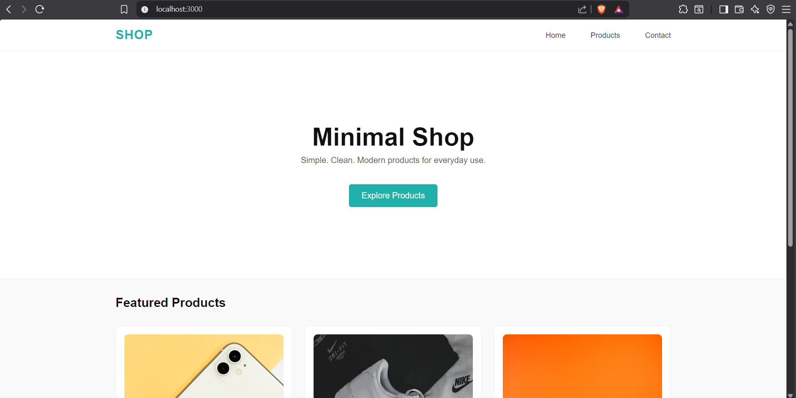
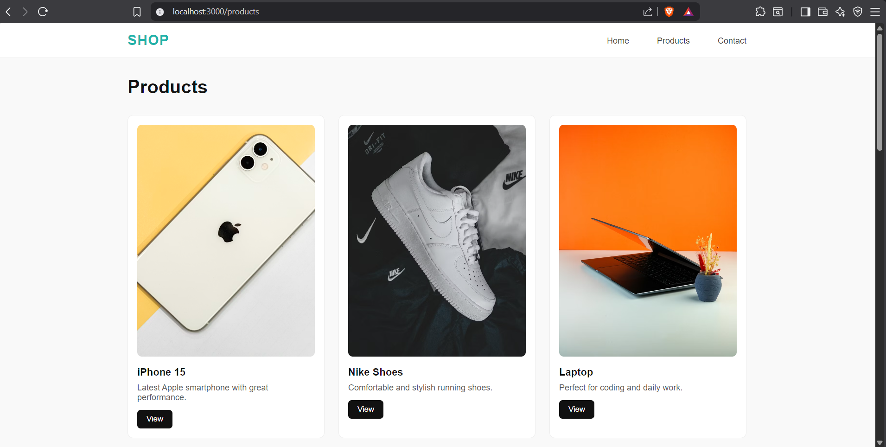
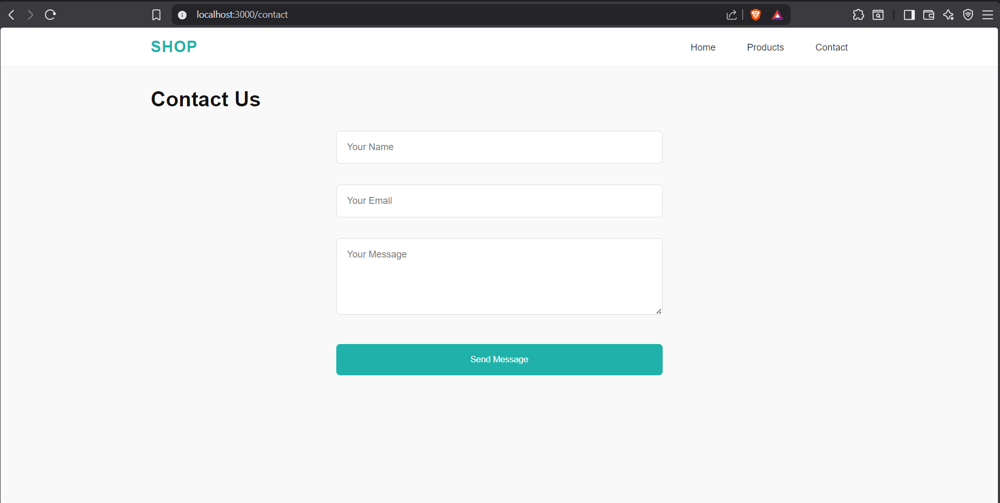

# 🛍️ Minimal Shop (EJS + Express)

A clean and responsive **minimal e-commerce UI** built using **Node.js, Express, and EJS**.  
This project demonstrates server-side rendering (SSR) with reusable components and a simple product flow.

---

## 🚀 Features

- 🧩 EJS templating (Server-Side Rendering)
- 📱 Fully responsive design
- 🧭 Navbar (Home, Products, Contact)
- 🛒 Product listing page
- 📬 Contact form UI
- 🎨 Minimal and modern UI design

---

## 🛠️ Tech Stack

- Node.js  
- Express.js  
- EJS  
- HTML5  
- CSS3  

---

# 📁 Project Structure
```bash
project-root/
├── views/
│   ├── index.ejs
│   ├── products.ejs
│   ├── contact.ejs
│   └── partials/
│       ├── header.ejs
│       └── footer.ejs
│
├── public/
│   └── style.css
│
├── screenshots/
│   ├── home.png
│   ├── products.png
│   └── contact.png
│
├── app.js
├── package.json
└── README.md
```


---

## ⚙️ Installation & Run

```bash
git clone https://github.com/Async-v/SHOP.git
cd your-project
npm install
node app.js
```
Open in browser:
``` 
http://localhost:3000
```

## 📸 Screenshots

### 🏠 Home Page


### 🛒 Products Page


### 📬 Contact Page



---
## 🔥 Future Improvements

- Product detail page (`/products/:id`)
- Add to cart functionality
- MongoDB database integration
- Authentication system
- Payment gateway integration

---

## 🙌 Author

**Async-v**

---

## ⭐ Support

If you like this project, consider giving it a ⭐ on GitHub!